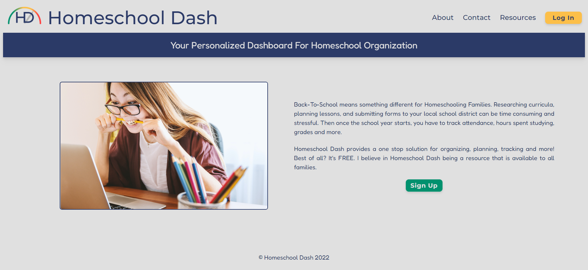

# Homeschool-Dash

A digital dashboard for homeschooling caretakers that tracks grades, users can fully customize the subjects that are added. Assignment grades are calculated, averaged, and displayed on the dashboard overview.

**Link to project:** https://homeschooldash.cyclic.app/

## How It's Made:

**Tech used:** HTML, CSS, TailwindCSS, EJS, JavaScript, Node.js, Express, MongoDB, and Passport for Authentication

## Optimizations

**Stretch Goals:**
- Attendance Tracking
- Weighted grading (depending on market research)
- Calculate and display GPA
- Scheduling linked to calendar with reminders
- Goal Setting per child/Expectations
- A Curriculum Planner with Yearly/Monthly/Weekly overviews
- A Supply list
- Reading list
- Ability to save resources for each subject (like a project board to save links for digital resources or projects etc)
- Ability to generate forms for each child for states where it's required by the district
- Resource Links (ESPECIALLY FREE ONES)

**SUPER Stretch Goals:**
- Forums to rehome curricula
- Reviews for individual curricula
- Ability to upload/save documents to account
- Resource/Project suggestions by grade/subject
- Meter based on logo that changes based on the GPA

## Lessons Learned: